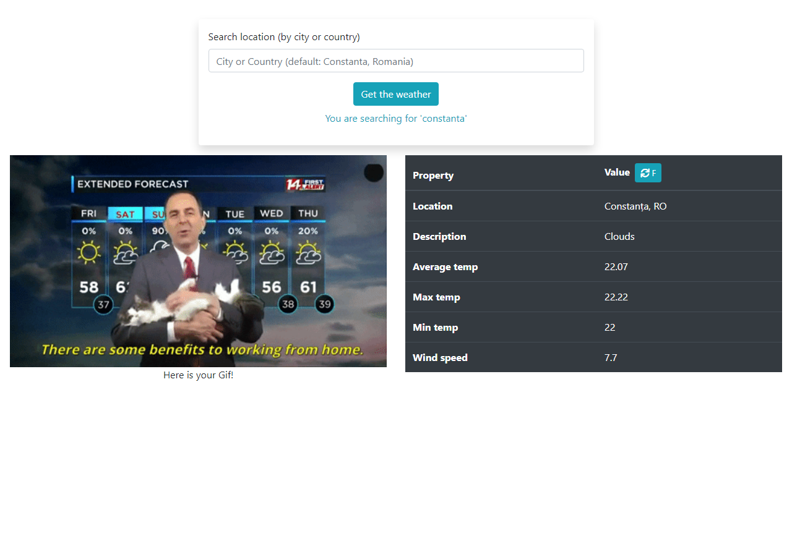

  

# Web app where users can searh the current weather in their Cities or Countries.

> The app uses `axios` for API requests to [https://giphy.com/](https://giphy.com/) and [https://openweathermap.org/](https://openweathermap.org/).

## App functionality

- The guests can search for the current weather and receive a Gif related to the weather description.

## This web app is live, you can check it here: [Live demo](https://cristianceamatu.github.io/microverse-js-weather-api/)

## Screenshots of the app.

## Built With

- HTML/SCSS
- Webpack/ES6/Javascript
- Bootstrap

## Authors

👤 **Cristian Viorel Ceamatu**

- Email: [cristian.ceamatu@gmail.com](cristian.ceamatu@gmail.com)
- Github: [https://github.com/cristianCeamatu](https://github.com/cristianCeamatu)
- Twitter: [https://twitter.com/CristianCeamatu](https://twitter.com/CristianCeamatu)
- Linkedin: [https://www.linkedin.com/in/ceamatu-cristian/](https://www.linkedin.com/in/ceamatu-cristian/)

## 🤝 Contributing

Our favourite contributions are those that help us improve the project, whether with a contribution, an issue, or a feature request!

## Show your support

If you've read this far....give us a ⭐️!

## 📝 License

This project is licensed by Microverse and the Odin Project

- Favicon made by <a href="https://www.flaticon.com/authors/freepik" title="Freepik">Freepik</a> from <a href="https://www.flaticon.com/" title="Flaticon"> www.flaticon.com</a>
